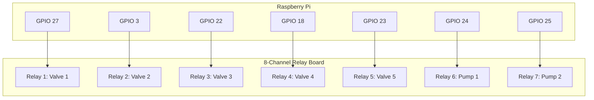

# Hardware Wiring Guide

This document describes the connection between the Raspberry Pi and the 8-channel relay board used in the UltraFiltration Control System.

## Component List
- **Raspberry Pi** (3B+ or 4 recommended)
- **8-Channel Relay Board** (Active LOW)
- **Power Supply** (5V DC for Pi and Relays)

## Wiring Diagram

### Raspberry Pi to Relay Board Connection
The following table shows the GPIO pin mapping (BCM numbering) and the corresponding relay channel.

| Device | Type | BCM Pin | Relay Channel |
| :--- | :--- | :--- | :--- |
| **Valve 1** | Digital Out | GPIO 27 | IN 1 |
| **Valve 2** | Digital Out | GPIO 3 | IN 2 |
| **Valve 3** | Digital Out | GPIO 22 | IN 3 |
| **Valve 4** | Digital Out | GPIO 18 | IN 4 |
| **Valve 5** | Digital Out | GPIO 23 | IN 5 |
| **Pump 1**  | Digital Out | GPIO 24 | IN 6 |
| **Pump 2**  | Digital Out | GPIO 25 | IN 7 |
| **Common GND** | Power | Ground | GND |
| **Relay VCC** | Power | 5V | VCC |

### Logical Flow Diagram

## Power Considerations
- The 8-channel relay board typically requires a separate 5V supply if many relays are active simultaneously.
- Ensure the JD-VCC jumper is correctly configured for your power setup.
- **DANGER:** High voltage (110V/220V) should only be handled by qualified personnel. Ensure all connections are insulated.
